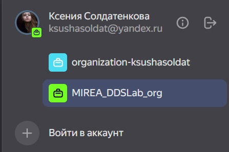
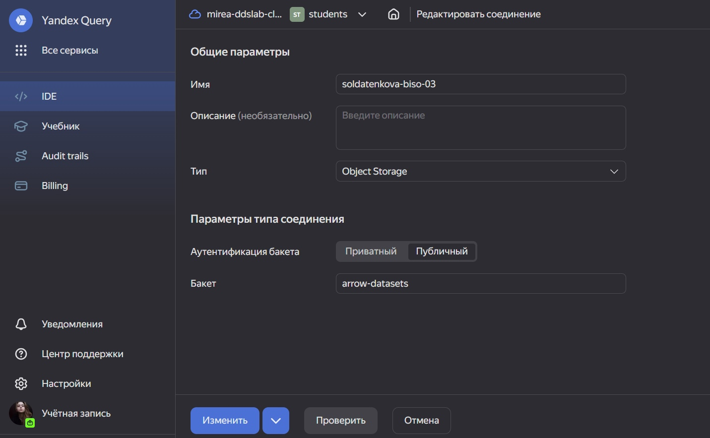
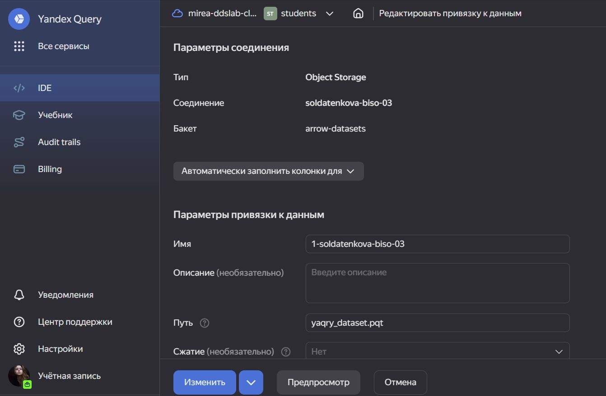
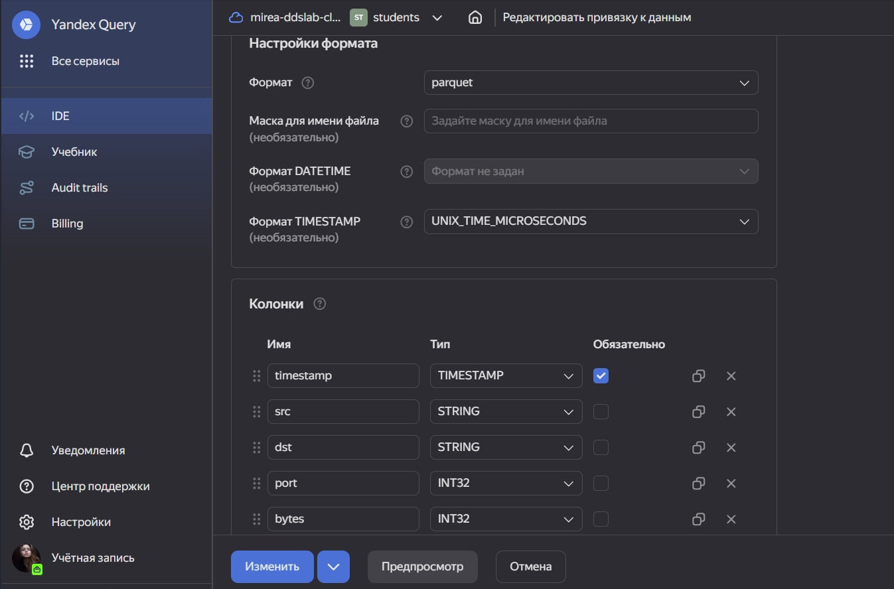
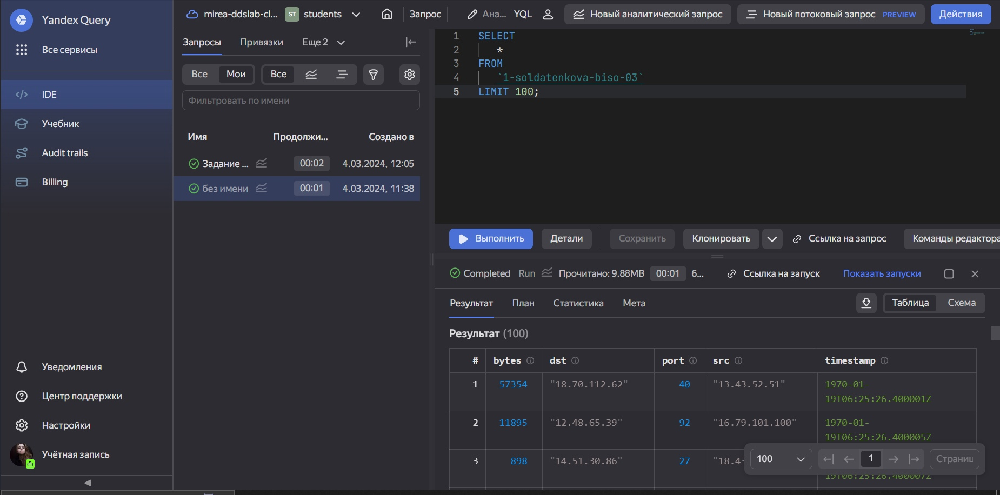
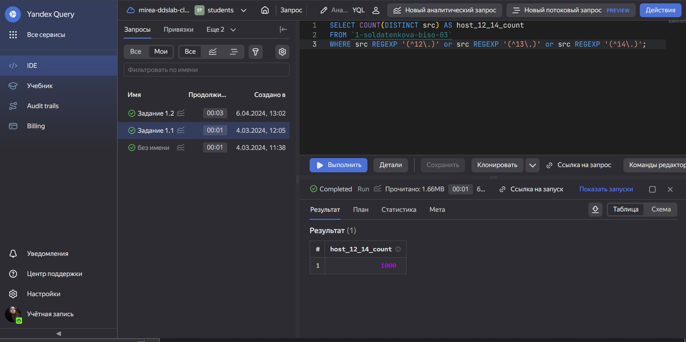
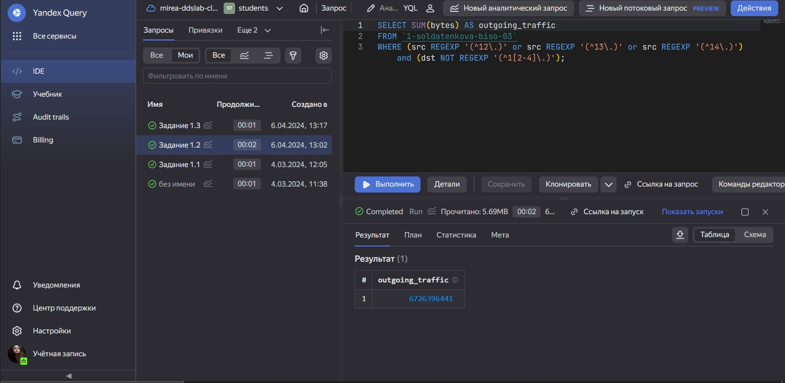
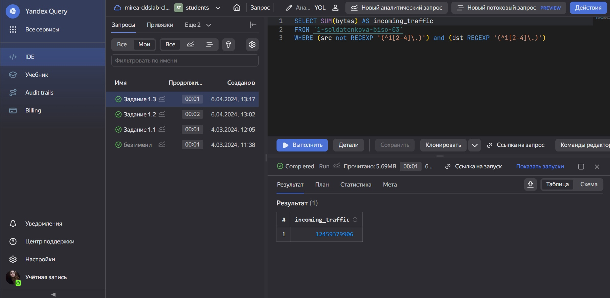

# Практическая работа №1
Солдатенкова К.А.

## Цель работы

1\. Изучить возможности технологии Yandex Query для анализа
структурированных наборов данных.

2\. Получить навыки построения аналитического пайплайна для анализа
данных с помощью сервисов Yandex Cloud.

3\. Закрепить практические навыки использования SQL для анализа данных
сетевой активности в сегментированной корпоративной сети.

## Ход работы

### Задание 1. Проверить доступность данных в Yandex Object Storage

1\. Проверьте доступность данных (файл yaqry_dataset.pqt) в бакете
arrow-datasets S3 хранилища Yandex Object Storage. О принципах
построения пути можно посмотреть здесь. Проверить можно просто перейдя
по правильно сконструированному URL в браузере.

    <https://storage.yandexcloud.net/arrow-datasets/yaqry_dataset.pqt>

### Задание 2. Подключить бакет как источник данных для Yandex Query

Yandex Query - это облачное решение для анализа данных, в котором задачи
организации хранения, обеспечения доступа и выполнения первичного
анализа данных полностью берет на себя сервис-провайдер, то есть Yandex
Cloud.

Перед проведением анализа нам надо связать Yandex Query с хранилищем
наших данных. В нашем случае это S3 Object Storage от Yandex Cloud.

0\. Войдем в свой аккаунт и подключимся к Yandex Cloud.



1\. Создаем соединение для бакета в S3 хранилище.

2\. Заполняем поля с учетом допустимых символов, выбираем тип
аутентификации. Вводим имя бакета в соответствующее поле и сохраняем.



3\. Теперь, после создания соединения, укажем какой объект использовать
в качестве источника данных. Для этого нужно сделать привязку данных.



4\. Опишем состав и формат входных данных.



Формат данных  
SCHEMA=( timestamp TIMESTAMP NOT NULL, src STRING, dst STRING, port
INT32, bytes INT32 )

5\. Если настройки сделаны правильно, то можно попробовать сделать
аналитический запрос и посмотреть результат



### Анализ

1\. Известно, что IP адреса внутренней сети начинаются с октетов,
принадлежащих интервалу \[12-14\]. Определите количество хостов
внутренней сети, представленных в датасете.

Запрос  
SELECT COUNT(DISTINCT src) AS host_12_14_count

FROM `1-soldatenkova-biso-03`

WHERE src REGEXP ‘(^12\\)’ or src REGEXP ‘(^13\\)’ or src REGEXP
‘(^14\\)’;

Ответ  
1000



2\. Определите суммарный объем исходящего трафика

Запрос  
SELECT SUM(bytes) AS outgoing_traffic

FROM `1-soldatenkova-biso-03`

WHERE (src REGEXP ‘(^12\\)’ or src REGEXP ‘(^13\\)’ or src REGEXP
‘(^14\\)’) and (dst not REGEXP ‘(^1\[2-4\]\\)’)

``` r
ingb <- 6726396441/(1024^3)
sprintf("%f Gb исходящего трафика", ingb)
```

    [1] "6.264445 Gb исходящего трафика"

Ответ  
6726396441 байт



3\. Определите суммарный объем входящего трафика

Запрос  
SELECT SUM(bytes) AS incoming_traffic

FROM `1-soldatenkova-biso-03`

WHERE (src not REGEXP ‘(^1\[2-4\]\\)’) and (dst REGEXP ‘(^1\[2-4\]\\)’)

``` r
ingb <- 12459379906/(1024^3)
sprintf("%f Gb входящего трафика", ingb)
```

    [1] "11.603702 Gb входящего трафика"

Ответ  
12459379906 байт



## Вывод

В ходе работы мы закрепили практические навыки использования SQL для
анализа данных сетевой активности в сегментированной корпоративной сети
и получили навыки построения аналитического пайплайна для анализа
данных.
