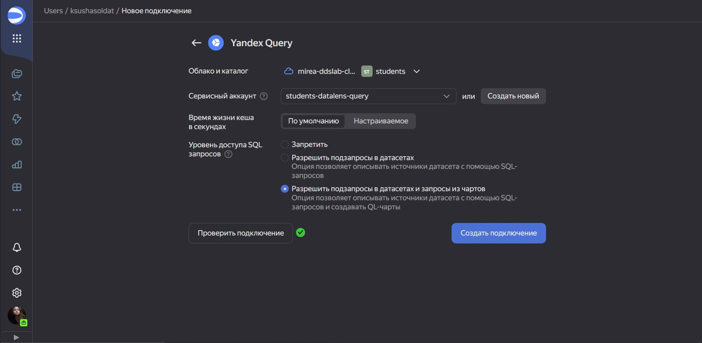
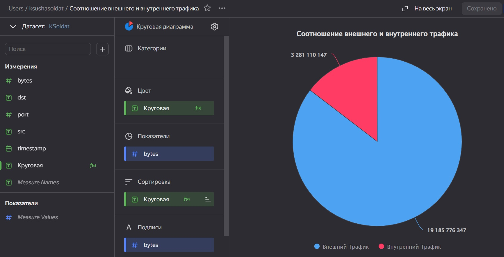
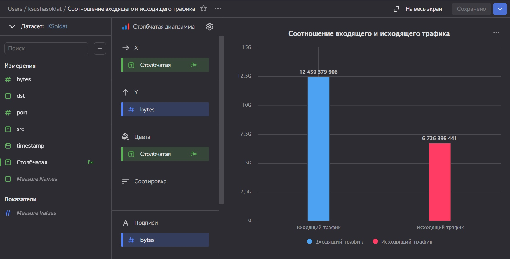
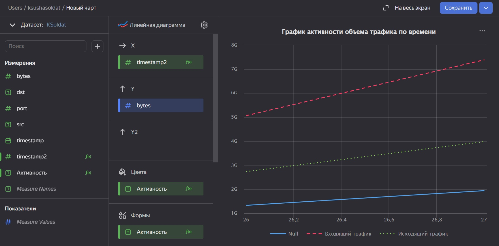
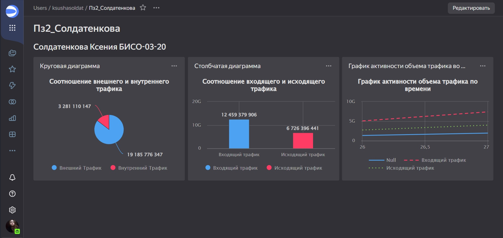

# Практическая работа №2
Солдатенкова К.А.

## Цель работы

1\. Изучить возможности технологии Yandex DataLens для визуального
анализа структурированных наборов данных.

2\. Получить навыки визуализации данных для последующего анализа с
помощью сервисов Yandex Cloud.

3\. Получить навыки создания решений мониторинга/SIEM на базе облачных
продуктов и открытых программных решений.

4\. Закрепить практические навыки использования SQL для анализа данных
сетевой активности в сегментированной корпоративной сети.

## Ход работы

### Задание 1. Настроить подключение к Yandex Query из DataLens

1\. Перейти в соответствующий сервис https://datalens.yandex.ru/.

2\. Выбрать “Подключения” – “Создать новое подключение”.

3\. Выбрать в разделе “Файлы и сервисы” Yandex Query.

4\. Настроить и проверить подключение.



### Задание 2. Представить в виде круговой диаграммы соотношение внешнего и внутреннего сетевого трафика



### Задание 3. Представить в виде столбчатой диаграммы соотношение входящего и исходящего трафика из внутреннего сетевого сегмента.



### Задание 4. Построить график активности (линейная диаграмма) объема трафика во времени.



### Задание 5. Все построенные графики вывести в виде единого дашборда в Yandex DataLens



## Оценка результатов

``` r
sprintf("Задание выполнено при помощи облачных сервисов Yandex Cloud и технологии Yandex DataLens, нам удалось познакомится с их функционалом и особенностями.")
```

    [1] "Задание выполнено при помощи облачных сервисов Yandex Cloud и технологии Yandex DataLens, нам удалось познакомится с их функционалом и особенностями."

## Вывод

В данной работе мы смогли закрепить практические навыки использования
SQL для анализа данных сетевой активности в сегментированной
корпоративной сети и получил навыки визуализации данных для последующего
анализа с помощью сервисов Yandex Cloud
